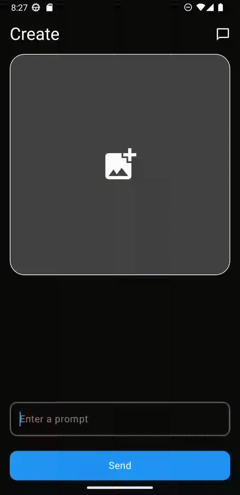
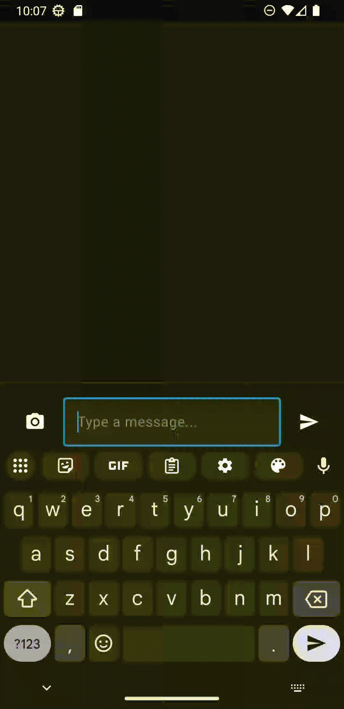

# FireImage 🎨

**AI-Powered Image Generation and Chat Android App**

FireImage is a cutting-edge Android application that harnesses the power of Google's Firebase AI services to deliver advanced image generation and conversational AI capabilities. Built with modern Android development practices using Jetpack Compose and Material Design 3.

## ✨ Features

### 🖼️ Text-to-Image Generation
Create stunning, high-quality images from simple text prompts using Google's Gemini 2.0 Flash image generation models.



### 🎨 Image-to-Image Editing  
Transform and enhance existing images with AI-powered modifications using natural language prompts.


### 💬 Intelligent AI Chat
Engage with Gemini AI in dynamic conversations about images, get creative suggestions, and receive AI assistance.



### ✏️ Chat-Based Image Editing
Edit and refine images through conversational interactions with the AI assistant.


## 🛠️ Technology Stack

- **Language**: Kotlin
- **UI Framework**: Jetpack Compose
- **Design System**: Material Design 3
- **Architecture**: MVVM with ViewModels and StateFlow
- **AI Services**: Firebase AI (Gemini 2.0 Flash, Imagen 3.0)
- **Navigation**: Navigation Compose
- **Image Processing**: Coil 3.2.0
- **Build System**: Gradle with Kotlin DSL

## 📱 Requirements

- **Minimum SDK**: Android 7.0 (API level 24)
- **Target SDK**: Android 15 (API level 35)
- **Compile SDK**: Android 15 (API level 35)
- **Java Version**: Java 11

## 🚀 Setup & Installation

### Prerequisites
1. Android Studio Arctic Fox or later
2. JDK 11 or later
3. Firebase project with AI services enabled
4. Google AI API key

### Installation Steps

1. **Clone the repository**
   ```bash
   git clone https://github.com/yourusername/FireImage.git
   cd FireImage
   ```

2. **Set up Firebase**
   - Create a new Firebase project at [Firebase Console](https://console.firebase.google.com/)
   - Enable Firebase AI services
   - Download `google-services.json` and place it in the `app/` directory

3. **Configure API Keys**
   - Obtain your Google AI API key
   - Add your API key to your Firebase project configuration

4. **Build and Run**
   ```bash
   ./gradlew assembleDebug
   ```
   Or open the project in Android Studio and run directly.

## 🏗️ Architecture

The app follows modern Android architecture patterns:

```
├── models/           # Data classes and UI state models
├── navigation/       # Navigation components and screen definitions  
├── screens/         
│   ├── chat/        # Chat functionality and UI
│   └── image_generation/  # Image generation screens
├── ui/
│   └── theme/       # Material Design theme configuration
└── utils/           # Utility functions and helpers
```

### Key Components

- **ImageGenerationScreen**: Main interface for creating and editing images
- **ChatScreen**: Conversational AI interface with image support
- **ImageGenUtil**: Core AI integration and image processing utilities
- **ViewModels**: State management using StateFlow and lifecycle-aware components

## 🎯 Core Capabilities

- **Multi-modal AI**: Supports both text and image inputs
- **Real-time Processing**: Live image generation and editing
- **Conversational Interface**: Natural language interaction with AI
- **Modern UI/UX**: Smooth animations and Material Design 3
- **Responsive Design**: Optimized for various screen sizes

## 🔧 Key Dependencies

```toml
# Core Android
androidx.compose.bom = "2025.06.00"
androidx.activity.compose = "1.10.1"
androidx.navigation.compose = "2.9.0"

# Firebase AI
firebase.bom = "33.15.0"
firebase.ai = "latest"

# Image Processing  
coil = "3.2.0"
```

## 🎨 Use Cases

- **Creative Professionals**: AI-assisted image creation and editing
- **Content Creators**: Quick visual asset generation
- **Designers**: Rapid prototyping and concept visualization
- **Enthusiasts**: Exploring cutting-edge AI image technology

## 🤝 Contributing

1. Fork the repository
2. Create your feature branch (`git checkout -b feature/AmazingFeature`)
3. Commit your changes (`git commit -m 'Add some AmazingFeature'`)
4. Push to the branch (`git push origin feature/AmazingFeature`)
5. Open a Pull Request

## 📄 License

This project is licensed under the MIT License - see the [LICENSE](LICENSE) file for details.

## 🙏 Acknowledgments

- Google Firebase AI team for providing cutting-edge AI services
- Android Jetpack Compose team for the modern UI toolkit
- Material Design team for the beautiful design system

---

**Made with ❤️ using Google's Gemini AI** 